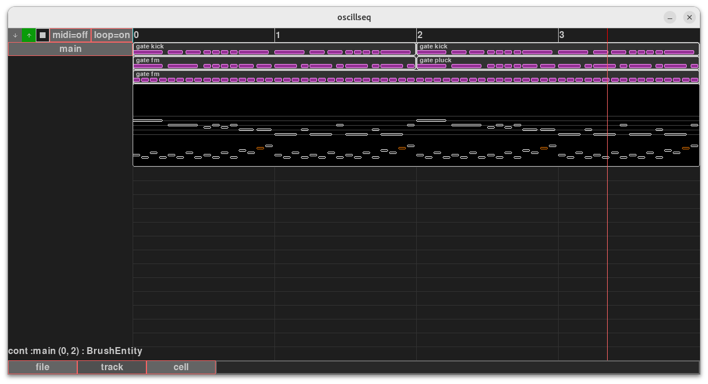
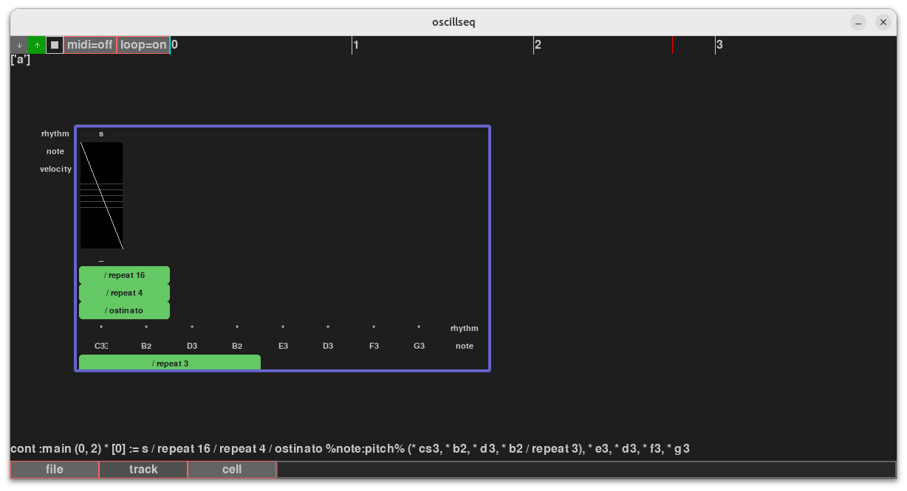
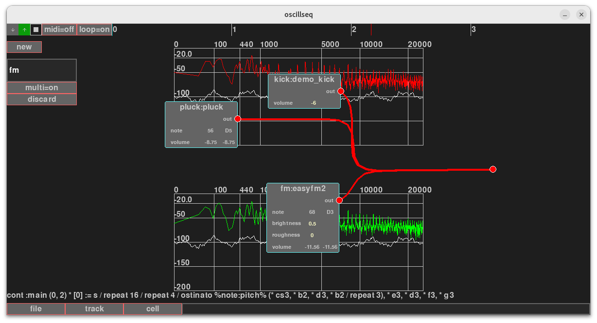

# Oscillseq

This repository consists of my repeated attempts to create a music sequencer.
At winter 2026, I got things working and finally understood how to create this kind of software.

This page is for users of the software, or any random person coming up to look.

## INSTALLATION

Clone the repository to access the source code:

    git clone https://github.com/cheery/oscillseq.git

Setup virtual environment:

    python3 -m venv venv
    source venv/bin/activate
    
Then install needed packages:

    pip3 install mido supriya numpy pygame lark

## HOW TO RUN IT

Note, save contents often. The program is prone to crash.

First we construct the syntdefs used by the software. They will populate the synthdefs/ -directory.

    python3 build_synthdefs.py

Then we run the example file:

    python3 -m main4 examples/melody.seq

## HOW TO USE IT

The whole program is built around a command language.
There's a textbox below on the screen to insert commands.

There are also some small mouse movements that do work, but they're minority.

### GENERIC

    remove           -- removes a selected entity
    up               -- goes to larger selection, "up the tree"

### CLIPS

Clip is a set of entities used to populate the timeline.

    mk clipname      -- creates a clip named clipname
    : clipname       -- selects a clip
    (0,0)            -- selects an entity slot at (t=0,lane=0)
    move (0,1)       -- moves a selected slot to (t=0,lane=1)
    ... (0,3)        -- from a clip selection, locates what entity can be "seen" at that location and builds a selection to it.
    *                -- dereferences an entity, eg, "zooms" into it.

### ATTACHING TO ENTITY SLOTS

    &clipname        -- attaches a clip to entity slot
    @viewname        -- attaches a view to entity slot
    %%               -- attaches a track brush to entity slot

### PROPERTY FIELDS

The clips and entities contain configuration fields,
or 'properties'.

    .attrib  -- selects an property named 'attrib'
    = c4               -- sets a value 'c4' to the selected property.

Known property fields:

    .synth             -- selects a synth module to control.
    .brush             -- selects a mode of control (hocket, gate, once, quadratic, slide, control)
    .view              -- selects a view style (pianoroll, staves)
    .above             -- how many empty rows above staves view.
    .below             -- how many empty rows below staves view
    .count             -- amount of rows in staves view.
    .bot               -- lowest note in pianoroll.
    .top               -- highest note in pianoroll.

    .beats_per_measure -- beats per measure
    .beat_division     -- how the beats are divided
    .staccato          -- how the staccato is played (value between 0 and 1, default=0.25)
    .normal            -- how the normal note is played (value between 0 and 1, default=0.85)
    .tenuto            -- how the tenuto is played (value between 0 and 1, default=1)

### VALUES

Lot of things in oscillseq are values. We mainly talk about numeric values but there are some additional ones. Musical notation uses the following syntax:

    PITCH CLASS + ACCIDENTAL + OCTAVE
    Eg. cs4, cb4, c5, 

Also we have "dynamics":

    ppp, pp, p, mp, mf, f, ff, fff

These map to dbfs according to a table in `model2/schema.py`

### TRACK BRUSHES

The %% denotes which fields are given to the track. Eg. %note:pitch@a% marks that 'note' -field, typed as 'pitch', showing on view 'a'.

Track is a sequence of symbols, each with attributes given to control a synthetizer module.

The symbols are some of these, each one denotes half duration from symbol before it.

    |8| |4|, x, w, h, q, e, s, t, u, v

You may augment it with a dot symbol to add a duration "half" from it after.

    q.

There are "styles" s - staccato, t - tenuto, g -grace. To control the shape of the duration.

    q@s

The note is annotated with attributes, eg:

    q@t cs4 fff

If there's a header %note:pitch,volume:db%. Then this note is equivalent with:

    q@t note=cs4 velocity=fff

We may also leave a duration unfilled, we denote it with a star.

Major detail in the notation is that we can augment it with various things:

    q[e, e, e]                    -- creates a tuplet, in this case, a triplet.
    (/ euclidean 3 7)             -- a macro forming an euclidean rhythm with pulses=3, steps=7.
    (q, e, e / repeat 6)          -- a macro repeating notes 6 times.
    (q, e, e, q, e, e / rotate 2) -- macro rotating 2 notes (left or right?)
    (q, e, q, e / retrograde)     -- macro reversing the notes
    (q, q, q, q / ostinato %note:pitch% * c4, * c5) -- macro producing an ostinato playing c4,c5,c4,c5 from its contents.

And we got commands to move in the note selection:

    := q, q, q, q   -- writes four quarter notes in place.
    [0:4]           -- selects a range between 0, and 4.
    [3]             -- selects item at index 3.
    <               -- descends in a selection.
    >               -- descends in a selection (sideways)
    eval            -- evaluates the selection. (not implemented yet)

## SCREENSHOTS

 

 

 

